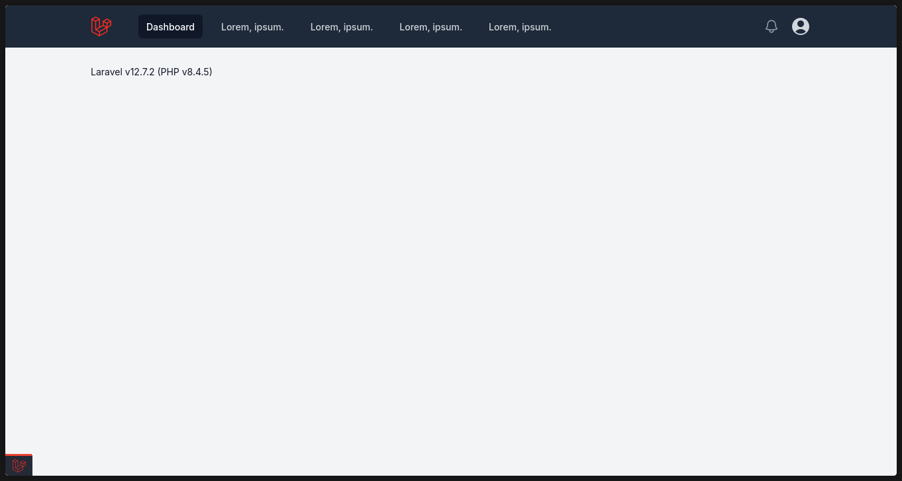

[](https://github.com/SantosVilanculos/skeleton-inertiajs/actions)
[](https://packagist.org/packages/santosvilanculos/skeleton-inertiajs)
[](https://packagist.org/packages/santosvilanculos/skeleton-inertiajs)
[](https://github.com/SantosVilanculos/skeleton-inertiajs/blob/main/LICENSE)



The skeleton application for the [Laravel framework](https://laravel.com/) and [Inertia](https://inertiajs.com/).

## Installation

```sh
laravel new --using=santosvilanculos/skeleton-inertiajs
```

## Features

- **Frontend**: React & TypeScript for a modern, type-safe UI.
- **Styling**: TailwindCSS for a utility-first CSS framework.
- **HTTP Requests**: Axios for promise-based HTTP client.
- **Validation**: Zod for TypeScript-first schema validation.
- **Development**: IDE Helper, Debugbar, and Laradumps for an enhanced DX.
- **Code Quality**: Prettier, Rector, PHPStan, and ESLint for consistent, high-quality code.
- **Testing**: Faker.js for generating realistic test data.
- **Logging**: Web-based log viewer for easy log management.
- **Localization**: English (en) and Portuguese (pt_PT) translations included.
- **Typography**: Inter font for a clean and readable UI.
- **Environment**: Automatic environment variable parsing and validation.
